# Billion-Scale UUID Generator

This project implements a high-performance, billion-scale UUID generator using a Snowflake sidecar pattern. It is based on the architectural recommendations for a billion-scale system detailed in [this article](https://dilipkumar.medium.com/design-a-system-to-generate-a-unique-id-1517dc624975).

## Component Diagram

This diagram illustrates the overall architecture, showing how the application container communicates with the ID generator sidecar via localhost IPC, and how the sidecar optionally connects to external dependencies based on the chosen algorithm.


## Architecture


The system consists of two main components deployed together in a single Kubernetes Pod (Sidecar pattern):

1.  **App Container (Consumer)**: A lightweight microservice (available in C++ `src/cpp/app.cpp` and Golang `src/go/app/main.go`) that acts as the main application. It connects to the Snowflake sidecar via localhost IPC (TCP port 8080) to request unique IDs.
2.  **Snowflake Sidecar (Generator)**: A high-performance binary (available in C++ `src/cpp/id_generator.cpp` and Golang `src/go/generator/main.go`) that generates 64-bit IDs based on either the standard Snowflake or HLC Snowflake algorithm. It uses:
    -   **Time**: 41-bit timestamp derived from the system clock (milliseconds since custom epoch).
    -   **Node**: 10-bit node ID dynamically derived from the last 10 bits of the container's IPv4 address.
    -   **Seq**: 12-bit local atomic counter to handle multiple requests within the same millisecond.

## Supported Languages

This project provides implementations of all algorithms in multiple languages to demonstrate how these concepts can be applied across different technology stacks.

*   [C++ Implementation](src/cpp/CPP.md)
*   [Golang Implementation](src/go/GOLANG.md)
*   [Java Implementation](src/java/JAVA.md)
*   [Node.js Implementation](src/node/NODEJS.md)
*   [Python Implementation](src/python/PYTHON.md)

### Generator Variants

The sidecar supports eight different ID generation algorithms, configurable via the `GENERATOR_TYPE` environment variable:

1.  **Standard Snowflake** (`GENERATOR_TYPE=SNOWFLAKE`): The default implementation. It uses a strict physical clock. If the system clock moves backwards (e.g., due to NTP sync), it will fail-fast and refuse to generate IDs to prevent duplicates. See [`algorithms/snowflake/README.md`](algorithms/snowflake/README.md) for details.
2.  **HLC Snowflake** (`GENERATOR_TYPE=HLC_SNOWFLAKE`): A Hybrid Logical Clock variant. It combines physical time with a logical counter. If the clock moves backwards, it gracefully advances the logical time instead of failing, providing higher availability at the cost of slight timestamp drift during anomalies. See [`algorithms/hlc-snowflake/README.md`](algorithms/hlc-snowflake/README.md) for details.
3.  **Instagram Snowflake** (`GENERATOR_TYPE=INSTA_SNOWFLAKE`): Instagram's Sharding Variation. It modifies the bit distribution to use 13 bits for the Shard ID (allowing 8192 shards) and 10 bits for the sequence (1024 IDs/ms). Ideal for massive database sharding. See [`algorithms/insta-snowflake/README.md`](algorithms/insta-snowflake/README.md) for details.
4.  **Sonyflake** (`GENERATOR_TYPE=SONYFLAKE`): Sony's Scale Variation. It uses 10ms time units (extending lifespan to 174 years), 16 bits for Machine ID (65,536 nodes), and 8 bits for sequence (256 IDs/10ms). Ideal for massive global deployments with lower per-node throughput requirements. See [`algorithms/sonyflake/README.md`](algorithms/sonyflake/README.md) for details.
5.  **UUID Version 4** (`GENERATOR_TYPE=UUIDV4`): Standard 128-bit random UUID (e.g., `123e4567-e89b-12d3-a456-426614174000`). This completely bypasses the Snowflake logic and generates a random, hex-encoded string. See [`algorithms/uuidv4/README.md`](algorithms/uuidv4/README.md) for details.
6.  **UUID Version 7** (`GENERATOR_TYPE=UUIDV7`): Time-ordered 128-bit UUID. Combines a 48-bit Unix timestamp with 74 bits of randomness. Sorts sequentially, making it highly optimized for database indexing compared to UUIDv4. See [`algorithms/uuidv7/README.md`](algorithms/uuidv7/README.md) for details.
7.  **Database Auto-Increment** (`GENERATOR_TYPE=DB_AUTO_INC`): Flickr Ticket Server approach. Uses a Multi-Master MySQL setup with `AUTO_INCREMENT` and `REPLACE INTO` to generate unique 64-bit IDs. Requires running the database tier via Kubernetes first. See [`algorithms/db-auto-inc/README.md`](algorithms/db-auto-inc/README.md) for details.
8.  **Pre-Generated Blocks & Dual Buffering** (`GENERATOR_TYPE=DUAL_BUFFER`): Meituan Leaf approach. Fetches blocks of IDs from a database and serves them from memory. Uses a background thread to fetch the next block before the current one runs out, ensuring extremely high throughput and low latency. See [`algorithms/dual-buffer/README.md`](algorithms/dual-buffer/README.md) for details.
9.  **Etcd-Coordinated Snowflake** (`GENERATOR_TYPE=ETCD_SNOWFLAKE`): A Snowflake variant that uses `etcd` to dynamically and safely assign Node IDs, preventing collisions in containerized environments. See [`algorithms/etcd-snowflake/README.md`](algorithms/etcd-snowflake/README.md) for details.
10. **Google Cloud Spanner Sequence** (`GENERATOR_TYPE=SPANNER`): Uses Google Cloud Spanner's native `bit_reversed_positive` sequence to generate globally unique, evenly distributed 64-bit IDs. See [`algorithms/spanner/README.md`](algorithms/spanner/README.md) for details.
11. **Google Cloud Spanner TrueTime** (`GENERATOR_TYPE=SPANNER_TRUETIME`): Uses Google Cloud Spanner's TrueTime commit timestamps combined with a Shard ID and Transaction ID to generate globally unique, perfectly ordered string UUIDs. See [`algorithms/spanner-truetime/README.md`](algorithms/spanner-truetime/README.md) for details.

## Flow Diagram

This flowchart details the routing logic within the sidecar, demonstrating how it selects the appropriate ID generation algorithm based on the `GENERATOR_TYPE` environment variable.



## Sequence Diagram

This sequence diagram outlines the typical request lifecycle, including any necessary initialization with external services, and the subsequent ID generation process for each application request.


## Prerequisites

- Docker
- `kubectl` configured to communicate with your cluster
- `kind` (Kubernetes in Docker) for local testing

### Installing `kind` on Linux

To quickly set up a local Kubernetes cluster for testing, you can install `kind`. Run the following commands on your Linux machine:

```bash
curl -Lo ./kind https://kind.sigs.k8s.io/dl/v0.20.0/kind-linux-amd64
chmod +x ./kind
sudo mv ./kind /usr/local/bin/kind
```

Once installed, create a new local cluster:

```bash
kind create cluster --name uuid-test-cluster
```

## Quick Start (Automated)

The easiest way to build, deploy, and test the application is to use the provided `run.sh` script. This script will automatically:
1. Install `kind` if it's not already installed.
2. Clean up any existing test clusters.
3. Create a new `kind` cluster.
4. Build the Docker images.
5. Load the images into the cluster.
6. Deploy the application.
7. Wait for the Pod to be ready and automatically tail the logs.

Simply run:

```bash
# Run with C++ implementation (default)
./run.sh --lang cpp

# Run with Golang implementation
./run.sh --lang go
```

You can also specify which ID generation algorithm to use by passing the `--id_generator_algo` flag (defaults to `SNOWFLAKE`):

```bash
# Run with C++ (default)
./run.sh --lang cpp --id_generator_algo SNOWFLAKE

# Run with Golang
./run.sh --lang go --id_generator_algo INSTA_SNOWFLAKE

# Run with Java
./run.sh --lang java --id_generator_algo SONYFLAKE

# Run with Node.js
./run.sh --lang node --id_generator_algo UUIDV4

# Run with Python
./run.sh --lang python --id_generator_algo DB_AUTO_INC
```

# Run with Sonyflake
./run.sh --id_generator_algo SONYFLAKE

# Run with UUID Version 4
./run.sh --id_generator_algo UUIDV4

# Run with UUID Version 7
./run.sh --id_generator_algo UUIDV7

# Run with Database Auto-Increment
./run.sh --id_generator_algo DB_AUTO_INC

# Run with Dual Buffering
./run.sh --id_generator_algo DUAL_BUFFER

# Run with Etcd-Coordinated Snowflake
./run.sh --id_generator_algo ETCD_SNOWFLAKE

# Run with Google Cloud Spanner Sequence
./run.sh --id_generator_algo SPANNER

# Run with Google Cloud Spanner TrueTime
./run.sh --id_generator_algo SPANNER_TRUETIME
```

## Credit

The entire code and documentation for this project was written with the help of [Gemini](https://gemini.google.com).