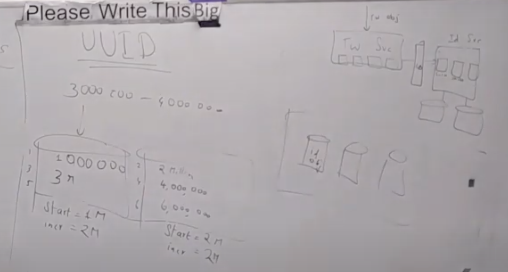
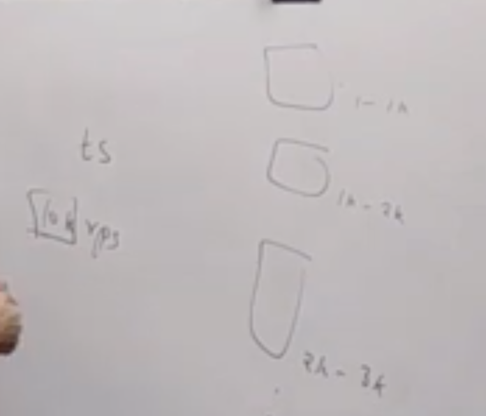

# Why we need to generate UUID?
- Sharded database system can't generate globally unique id
- Multiple micro services can't generate globally unique id
# What are different format of UUID?
1. Random number
Disadvantage: 
- collision are high
2. Hashing

a. MD5 - 128 bits hash value i.e. 16 octets i.e. 32 hexadecimal digits eg. `9e107d9d372bb6826bd81d3542a419d6`

b. Sha1 - 160 bits hash value i.e. 20 octets i.e. 40 hexadecimal digits eg. `2fd4e1c67a2d28fced849ee1bb76e7391b93eb12` 

c. Sha2 - It consists of following six hash functions
- Sha-224 i.e. 56 hexa digits `d14a028c2a3a2bc9476102bb288234c415a2b01f828ea62ac5b3e42f`
- Sha-256 i.e. 64 hexa digits `e3b0c44298fc1c149afbf4c8996fb92427ae41e4649b934ca495991b7852b855`
- Sha-384 i.e. 96 hexa digits `38b060a751ac96384cd9327eb1b1e36a21fdb71114be07434c0cc7bf63f6e1da274edebfe76f65fbd51ad2f14898b95b`
- Sha-512 i.e 128 hexa digits `cf83e1357eefb8bdf1542850d66d8007d620e4050b5715dc83f4a921d36ce9ce47d0d13c5d85f2b0ff8318d2877eec2f63b931bd47417a81a538327af927da3e`

Disadvantage:
- Long id
- Only feasible if needs deterministic id
3. Timestamp + Random number + host

Disadvantage:
- Chances of collision if host id is not included
4. Using database auto sequence 
(MySQL, Oracle etc)

Disadvantage:
- Single database so not fault tolerance
How to take care of fault tolerance?
- Have two database
    - One will generate odd sequence and second will generate even
    - Load balancer will distribute traffic to these two database
    - If one db is down then load balancer will send to active db
- Have n database

Problems:
- Write will be slow for high traffic

Better approach using database
- Pre-generate the block of ids

5. timestamp + seq
Benefits
- sort by id which gives sort by time
- 32 + 16 = 48 bits which is less than 64 bits

