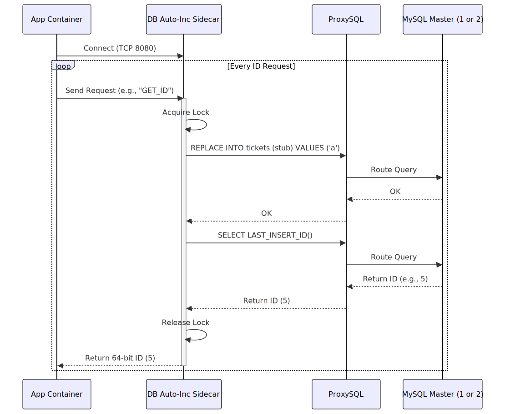

# Database Auto-Increment ID Generator (Flickr Ticket Server)

This directory contains the implementation and Docker setup for the Database Auto-Increment approach to ID generation. This approach was popularized by Flickr's Ticket Server.

## What is the Database Auto-Increment Approach?

Instead of relying on application-level logic (like Snowflake) to generate unique IDs, this approach offloads the responsibility to a relational database (like MySQL) using its built-in `AUTO_INCREMENT` feature.

To achieve high availability and avoid a single point of failure, the system uses a **Multi-Master Replication** setup with two (or more) MySQL instances.

## Design

## Component Diagram

This diagram illustrates the architecture including the application pod and the external database tier, featuring ProxySQL and multiple MySQL masters.


## Design


## How it Works

1.  **Two MySQL Masters**: We run two MySQL instances.
2.  **Offset and Increment**: To prevent them from generating the same IDs, we configure them with different offsets and increments:
    *   **Master 1**: `auto-increment-increment=2`, `auto-increment-offset=1` (Generates: 1, 3, 5, 7...)
    *   **Master 2**: `auto-increment-increment=2`, `auto-increment-offset=2` (Generates: 2, 4, 6, 8...)
3.  **ProxySQL**: A load balancer (ProxySQL) sits in front of the databases and routes traffic round-robin to both masters. If one master goes down, ProxySQL automatically routes all traffic to the surviving master.
4.  **REPLACE INTO**: The application executes a `REPLACE INTO tickets (stub) VALUES ('a')` query. The `tickets` table has a unique `stub` column. This query continuously overwrites the same row, forcing the `AUTO_INCREMENT` primary key to increase without growing the table size. The application then retrieves the `LAST_INSERT_ID()`.

## Running the Database Tier

Before running the generator with `GENERATOR_TYPE=DB_AUTO_INC`, you must deploy the database tier to your Kubernetes cluster:

```bash
kubectl apply -f lib/db-auto-inc/mysql-deployment.yaml
kubectl apply -f lib/db-auto-inc/proxysql-deployment.yaml
```

This will spin up `mysql1`, `mysql2`, and `proxysql` pods and services. The `id_generator` sidecar will connect to the `proxysql` service on port 6033.

## Implementation Details

- **MySQL Client**: The code uses `libmysqlclient` to connect to ProxySQL.
- **Thread Safety**: A `std::mutex` is used to ensure that only one thread executes the `REPLACE INTO` query on the shared MySQL connection at a time. For higher throughput, a connection pool should be implemented.
- **Resilience**: If a query fails (e.g., ProxySQL restarts or a connection drops), the generator attempts to reconnect and retry once before failing.

## Flow Diagram

This flowchart details the logic of executing a `REPLACE INTO` query to leverage MySQL's auto-increment feature, including the retry mechanism for resilience.



## Sequence Diagram

This sequence diagram shows the interaction between the sidecar, ProxySQL, and the MySQL databases to fetch the `LAST_INSERT_ID()`.



## Pros and Cons

### Pros
*   **Simple Concept**: Easy to understand and implement using existing database infrastructure.
*   **Strictly Sequential**: Generates strictly sequential IDs within a single master (though interleaved across multiple masters).
*   **Efficient Storage**: Generates 64-bit integers, which are highly optimized for database indexing and storage compared to 128-bit UUIDs.

### Cons
*   **Single Point of Failure**: Requires a complex multi-master setup with a load balancer (ProxySQL) to achieve high availability.
*   **Scaling Bottleneck**: Database writes become a severe bottleneck at scale (e.g., millions of IDs per second).
*   **Network Latency**: Requires a network round-trip to the database for every ID generation request.
*   **Operational Overhead**: Managing and maintaining a highly available database cluster is significantly more complex than stateless application-level generators like Snowflake.
