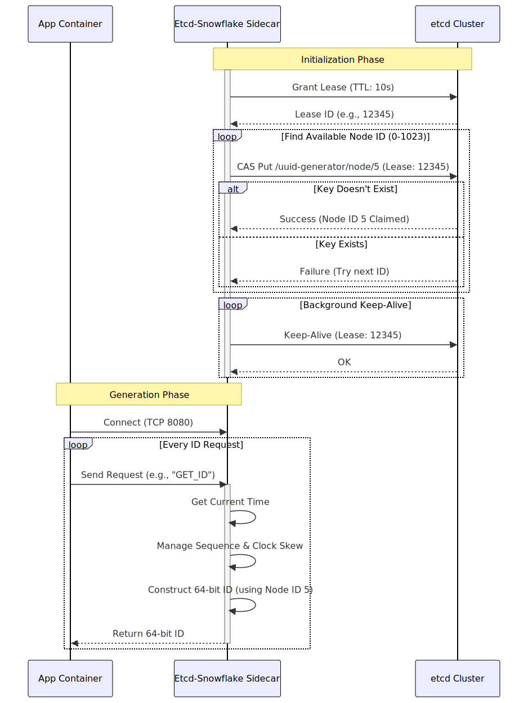

# Etcd-Coordinated Snowflake ID Generator Implementation Details

This directory contains the implementation of an Etcd-Coordinated Snowflake ID generation algorithm. This approach uses `etcd` to dynamically and safely assign Node IDs.

## What is the Etcd-Coordinated Variation?

The standard Snowflake algorithm relies on a unique 10-bit Node ID for each generator instance to prevent collisions. Often, this is derived from the instance's IP address or MAC address. However, in modern containerized environments (like Kubernetes), IP addresses can be reused or overlap across different subnets, leading to a small but non-zero risk of Node ID collisions.

This variation solves that problem by using `etcd` (a strongly consistent, distributed key-value store) as a central coordinator to assign and lease Node IDs.

The 64-bit ID structure remains exactly the same as the standard Snowflake:
- **1 bit**: Unused (always `0`).
- **41 bits**: Timestamp (milliseconds since `EPOCH`).
- **10 bits**: Node/Machine ID.
- **12 bits**: Sequence number.

## Component Diagram

This diagram illustrates the architecture, showing the sidecar's connection to an external etcd cluster for Node ID coordination.

## Design

## How it Works

1.  **Startup**: When the generator starts, it connects to the `etcd` cluster.
2.  **Lease Creation**: It creates a short-lived lease (e.g., 10 seconds) in etcd. 
    - *What is a Lease?* In etcd, a lease is a mechanism for managing the lifecycle of keys. You create a lease with a Time-To-Live (TTL). You can then attach keys to this lease. If the lease expires (because the client stops renewing it), etcd automatically deletes all keys attached to that lease.
3.  **Node ID Claiming**: It iterates through all possible Node IDs (0 to 1023). For each ID, it attempts to create a key in etcd (e.g., `uuid-generator/node/5`) attached to its lease.
    - It uses etcd's atomic Compare-And-Swap (CAS) transaction to ensure the key is only created if it doesn't already exist (`createRevision == 0`).
    - The first successful transaction grants that specific Node ID to the instance.
4.  **Keep-Alive**: A background thread continuously sends keep-alive requests to etcd to renew the lease before the TTL expires.
5.  **Shutdown/Crash**: If the instance shuts down gracefully or crashes unexpectedly, it stops sending keep-alives. After the 10-second TTL expires, etcd automatically deletes the lease and the associated Node ID key, freeing up that Node ID for another instance to claim.

## Implementation Details

- **Etcd Communication**: The code uses `libcurl` to communicate directly with etcd's HTTP/gRPC-Gateway API (v3).
- **Thread Safety**: The sequence and timestamp are managed using `std::atomic<uint64_t>` to ensure thread-safe, lock-free ID generation.
- **Clock Skew**: Like the standard Snowflake, this implementation uses a "fail-fast" spin-wait approach if the physical clock moves backwards.

## Flow Diagram

This flowchart details the initialization process of acquiring a lease and claiming a Node ID via etcd, followed by the standard Snowflake generation logic.

## Sequence Diagram

This sequence diagram outlines the interaction with etcd during startup to claim a Node ID, the background keep-alive process, and the subsequent ID generation.

## Pros and Cons

### Pros
*   **Guaranteed Uniqueness**: Completely eliminates the risk of Node ID collisions, even in highly dynamic containerized environments.
*   **Dynamic Scaling**: Instances can be spun up and down freely without manual Node ID configuration.
*   **Efficient Storage**: Generates 64-bit integers, which are highly optimized for database indexing and storage compared to 128-bit UUIDs.
*   **Time-Ordered**: IDs are roughly sortable by time (k-sortable), improving database insert performance.

### Cons
*   **External Dependency**: Requires a highly available `etcd` cluster to function. If etcd is down, new instances cannot start (though existing instances with valid leases can continue generating IDs until their lease expires, depending on implementation details).
*   **Startup Latency**: Claiming a Node ID requires network round-trips to etcd during startup.
*   **Complexity**: Adds complexity to the deployment and the generator code (managing leases, keep-alives, and HTTP requests).
