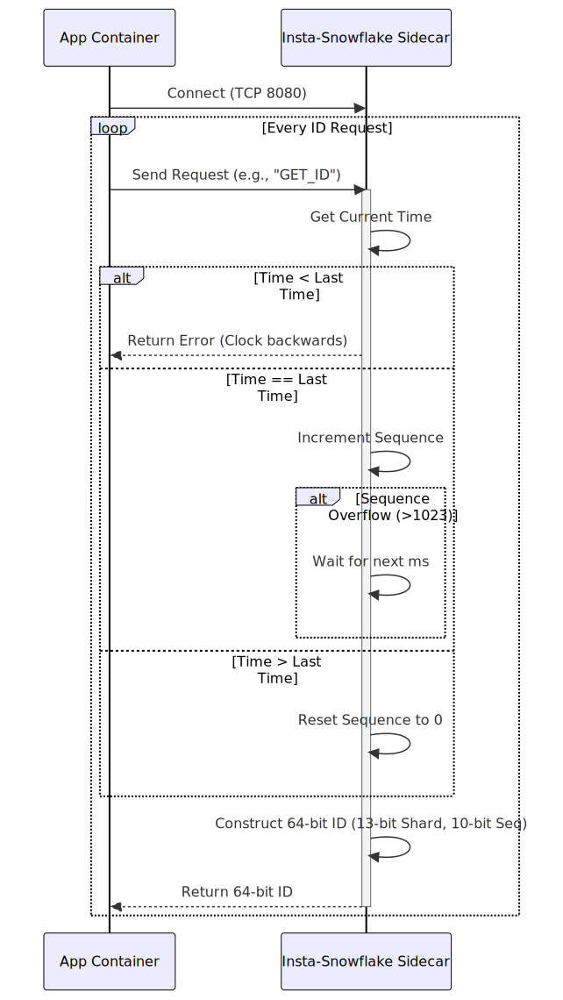

# Instagram Snowflake ID Generator Implementation Details

This directory contains the implementation of the Instagram Sharding Variation of the Snowflake ID generation algorithm. This variation is optimized for database sharding.

## What is the Instagram Variation?

While the standard Snowflake algorithm uses 10 bits for the Node ID and 12 bits for the Sequence, Instagram's approach modifies this distribution to better suit database sharding (e.g., PostgreSQL schemas).

The 64-bit ID structure is distributed as follows:
- **1 bit**: Unused (always `0`).
- **41 bits**: Timestamp (milliseconds since `EPOCH`).
- **13 bits**: Logical Shard ID.
- **10 bits**: Sequence number.

## Component Diagram

This diagram shows the sidecar architecture for the Instagram Snowflake generator.

## Design

## Why change the bit distribution?

### 1. More Shards (13 bits)
By allocating 13 bits to the Shard ID instead of 10, the system can support up to $2^{13} = 8192$ unique logical shards (compared to the standard 1024). This is highly beneficial for massive applications that need to partition their database into thousands of logical schemas to handle scale.

### 2. Smaller Sequence (10 bits)
To make room for the extra shard bits, the sequence is reduced from 12 bits to 10 bits. This means a single shard can generate up to $2^{10} = 1024$ unique IDs per millisecond (down from 4096). For most applications, generating 1 million IDs per second *per shard* is more than enough, making this a worthwhile trade-off for increased sharding capacity.

## Implementation Details

- **Shard ID Derivation**: Similar to the standard Snowflake implementation, this sidecar derives its Shard ID dynamically from the last 13 bits of the container's IPv4 address. In a real-world PostgreSQL environment, this might be replaced by the actual logical schema ID the application is currently writing to.
- **Thread Safety**: The sequence and timestamp are managed using `std::atomic<uint64_t>` to ensure thread-safe, lock-free ID generation.
- **Clock Skew**: Like the standard Snowflake, this implementation uses a "fail-fast" spin-wait approach if the physical clock moves backwards.

## Flow Diagram

This flowchart details the Instagram-specific Snowflake logic, highlighting the use of a custom epoch and the integration of a Shard ID.

## Sequence Diagram

This sequence diagram illustrates the ID generation process, showing how the timestamp, Shard ID, and sequence are combined.

## Pros and Cons

### Pros
*   **Massive Sharding**: Supports 8,192 shards (vs 1,024 nodes in standard Snowflake), making it ideal for heavily partitioned databases.
*   **Efficient Storage**: Generates 64-bit integers, which are highly optimized for database indexing and storage compared to 128-bit UUIDs.
*   **Time-Ordered**: IDs are roughly sortable by time (k-sortable), improving database insert performance.
*   **Decentralized**: No central coordinator is needed during ID generation.

### Cons
*   **Lower Throughput**: Generates up to 1,024 IDs per millisecond per shard (vs 4,096 in standard Snowflake).
*   **Clock Dependency**: Relies heavily on the system clock (NTP synchronization required).
*   **Availability Risk**: Fails fast and refuses to generate IDs if the clock moves backwards.
*   **Limited Lifespan**: The 41-bit timestamp limits the system's lifespan to ~69 years from the custom epoch.
*   **Shard ID Coordination**: Requires a reliable mechanism to assign unique Shard IDs to prevent collisions.
