# Google Cloud Spanner Sequence Generator Implementation Details

This directory contains the implementation of a UUID generator that leverages Google Cloud Spanner's built-in sequence generation capabilities.

## What is the Spanner Sequence Generator?

Google Cloud Spanner is a fully managed, globally distributed relational database service. It offers a native `SEQUENCE` object that can generate unique 64-bit integers. 

Crucially, Spanner supports a `bit_reversed_positive` option for sequences. This option takes the generated sequential number and reverses its bits. This is extremely important for distributed databases because it prevents "hotspotting" (where all new inserts go to the same physical server because their primary keys are sequential). The bit-reversed IDs are uniformly distributed across the entire 64-bit space.

## Design

## Component Diagram

This diagram shows the architecture where the sidecar communicates with Google Cloud Spanner via its REST API.


## Design


## How it Works

1.  **Initialization**: The generator connects to the Spanner instance (or the local emulator) via its REST API and creates a session.
2.  **ID Generation**: For every ID request, the generator executes the following SQL query:
    ```sql
    SELECT GET_NEXT_SEQUENCE_VALUE(SEQUENCE uuid_sequence)
    ```
3.  **Parsing**: The generator parses the JSON response from the REST API to extract the 64-bit integer and returns it to the application.

## Flow Diagram

This flowchart details the process of executing a SQL query against Spanner's sequence object and parsing the JSON response to extract the generated ID.



## Sequence Diagram

This sequence diagram illustrates the REST API interactions, including session creation and the execution of the `GET_NEXT_SEQUENCE_VALUE` query for each request.


## Pros and Cons

### Pros
*   **Fully Managed**: Offloads the complexity of ID generation entirely to a managed service (if using real Spanner).
*   **Globally Unique**: Spanner guarantees uniqueness across the globe.
*   **No Hotspotting**: The `bit_reversed_positive` option ensures IDs are uniformly distributed, optimizing database insert performance.
*   **Simplicity**: The generator code is very simple, just executing a single SQL query.

### Cons
*   **High Latency**: Every ID generation requires a network round-trip to Spanner. This is significantly slower than in-memory generation (like Snowflake) or block-fetching (like Dual Buffering).
*   **Cost**: Executing a query for every single ID can become expensive at scale in a real Spanner environment.
*   **Vendor Lock-in**: Ties the ID generation strategy tightly to Google Cloud Spanner.
