# UUID Version 4 Generator Implementation Details

This directory contains the implementation of a standard UUID Version 4 generator, which provides completely random 128-bit unique identifiers.

## What is UUID Version 4?

Unlike Snowflake-based IDs (which are 64-bit integers composed of a timestamp, node ID, and sequence), a UUIDv4 is a 128-bit value generated primarily from random numbers. 

The standard string representation is 36 characters long, formatted as 32 hexadecimal digits displayed in five groups separated by hyphens, in the form `8-4-4-4-12`. For example:
`123e4567-e89b-12d3-a456-426614174000`

## Component Diagram

This diagram shows the sidecar architecture for the UUIDv4 generator.

## Design

## Implementation Details

- **Randomness**: The generator uses `std::mt19937_64` (a 64-bit Mersenne Twister pseudo-random number generator) seeded by `std::random_device` to generate two 64-bit random numbers.
- **Version and Variant**: 
  - The 13th hex character is explicitly set to `4` (indicating Version 4).
  - The 17th hex character is explicitly set to `8`, `9`, `a`, or `b` (indicating the RFC 4122 variant).
- **Thread Safety**: Because `std::mt19937_64` is not thread-safe, a `std::mutex` is used to lock the random number generation step. This makes it slightly slower than the lock-free `std::atomic` approach used in the Snowflake variants, but it is necessary for safe concurrent random generation.
- **String Output**: Because a 128-bit value cannot fit into a standard 64-bit integer, this generator overrides the `next_id_string()` method of the `IdGenerator` interface to return the formatted string directly.

## Flow Diagram

This flowchart details the process of generating a UUIDv4, including acquiring a lock, generating random 64-bit numbers, and setting the specific version and variant bits.

## Sequence Diagram

This sequence diagram illustrates the interaction flow, highlighting the thread-safe random number generation and string formatting steps.

## Pros and Cons

### Pros
*   **Extremely Simple**: No coordination, no clock dependency, and virtually zero chance of collision.
*   **Decentralized**: No central coordinator or node ID assignment is needed.
*   **High Security**: Completely random, making it impossible to guess the next ID (useful for session tokens or API keys).

### Cons
*   **Storage Inefficiency**: 128-bit size requires twice the storage of 64-bit integers.
*   **Database Performance Penalty**: Completely random IDs cause severe B-tree fragmentation in relational databases, leading to poor insert performance and bloated indexes.
*   **Not Time-Ordered**: Cannot be sorted by creation time without a separate timestamp column.
