# Pre-Generated Blocks & Dual Buffering ID Generator

This directory contains the C++ implementation and Kubernetes setup for the Pre-Generated Blocks & Dual Buffering approach to ID generation. This approach is often popularized by systems like Meituan's Leaf.

## What is the Dual Buffering Approach?

Instead of hitting the database for *every single ID* (which creates a massive bottleneck), the application fetches a *block* (or segment) of IDs from the database at once (e.g., 1000 IDs). The application then serves these 1000 IDs purely from memory, which is extremely fast.

To prevent a sudden latency spike when a block runs out and the application has to wait for a database round-trip to fetch the next block, this approach uses **Dual Buffering**:
1.  The application maintains two buffers (segments).
2.  When the primary buffer is consumed past a certain threshold (e.g., 20% remaining), a background thread asynchronously fetches the next block of IDs from the database into the secondary buffer.
3.  When the primary buffer is exhausted, the application seamlessly swaps to the secondary buffer with zero wait time.

## Component Diagram

This diagram shows the architecture involving the application pod and the external MySQL database used for storing ID segments.



## Design


## Running the Database Tier

Before running the C++ generator with `GENERATOR_TYPE=DUAL_BUFFER`, you must deploy the database tier to your Kubernetes cluster:

```bash
kubectl apply -f lib/dual-buffer/mysql-deployment.yaml
```

This will spin up a `mysql-dual-buffer` pod and service, and automatically initialize the `id_segments` table with a starting block of 1000 IDs for the `default` business tag.

## Flow Diagram

This flowchart explains the dual buffering logic, detailing how the primary buffer serves IDs and how the background thread is triggered to fetch the next block when the threshold is reached.



## Sequence Diagram

This sequence diagram illustrates the asynchronous buffer refill process, showing the background thread fetching ID blocks from the database without blocking application requests.


## Pros and Cons

### Pros
*   **Extremely High Throughput**: Serving IDs from memory is incredibly fast, easily supporting millions of IDs per second per node.
*   **Low Latency**: The dual buffering mechanism hides the database latency. The application almost never has to wait for a database query to complete.
*   **Reduced Database Load**: The database is only queried once every `step` IDs (e.g., once every 1000 IDs), drastically reducing the load compared to the DB Auto-Increment approach.
*   **Strictly Sequential (per node)**: IDs are strictly sequential within the blocks assigned to a specific node.

### Cons
*   **ID Gaps on Crash**: If the application crashes, any unused IDs in the current memory block are lost forever, creating gaps in the sequence.
*   **Not Strictly Sequential Globally**: If multiple nodes are generating IDs concurrently, the overall sequence across all nodes will be interleaved blocks, not strictly sequential.
*   **Complexity**: Requires maintaining background threads, condition variables, and careful synchronization to manage the dual buffers safely.
*   **Database Dependency**: Still relies on a central database for block allocation, which must be made highly available in a production environment.
