# Google Cloud Spanner TrueTime Generator Implementation Details

This directory contains the C++ implementation of a UUID generator that leverages Google Cloud Spanner's TrueTime commit timestamps.

## What is the Spanner TrueTime Generator?

Google Cloud Spanner utilizes TrueTime to provide highly accurate, globally synchronized commit timestamps for distributed transactions. This generator creates a composite UUID by combining a Shard ID, the Spanner commit timestamp, and the Spanner transaction ID.

The resulting UUID format is: `[ShardID]-[CommitTimestamp]-[TransactionID]`

This approach provides perfect chronological ordering while avoiding hotspotting issues by distributing writes across different shards. The inclusion of the transaction ID guarantees absolute uniqueness even if multiple transactions commit at the exact same TrueTime timestamp.

## Design

## Component Diagram

This diagram shows the architecture where the sidecar communicates with Google Cloud Spanner via its REST API to begin and commit transactions.

## Flow Diagram

This flowchart details the process of beginning a transaction, committing it to retrieve the TrueTime timestamp, and formatting the final UUID string.

## Sequence Diagram

This sequence diagram illustrates the REST API interactions, including session creation at startup and the transaction lifecycle for each request.

## Pros and Cons

### Pros
*   **Perfect Chronological Ordering**: TrueTime provides highly accurate, globally synchronized timestamps.
*   **Globally Unique**: The combination of Shard ID, Timestamp, and Transaction ID guarantees uniqueness.
*   **No Hotspotting**: The Shard ID prefix ensures that writes are distributed evenly across the database.

### Cons
*   **High Latency**: Every ID generation requires two network round-trips to Spanner (`beginTransaction` and `commit`).
*   **Cost**: Executing two API calls for every single ID can become expensive at scale.
*   **String Format**: The resulting UUID is a string, not a 64-bit or 128-bit integer, which may require more storage space.
